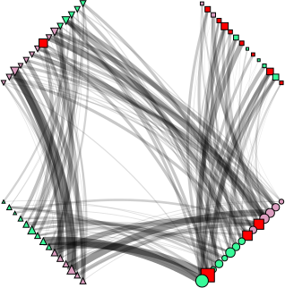
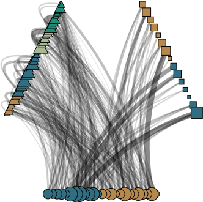

## PyNetViewer: A tool for visualization of bipartite, k-partite and heterogeneous networks

**About**

PyNetViewer is a python and igraph based tool for visualization of bipartite, k-partite and heterogeneous networks. The main aim of the PyNetViewer is the visualization of the benchmark networks synthesized by the Bnoc tool. 

**Download**

- You can download PyNetViewer software in http://www.alanvalejo.com.br/software?name=pynetviewer
- You can download Bnoc software in http://www.alanvalejo.com.br/software?name=bnoc

**Usage**

	$ python pynetviewer.py [options]

| Option                      | Domain                | Default        | Description                                  |
| --------------------------- | ----------------------| -------------- | -------------------------------------------- |
| -in --input                 | str [FILE]            | 'input'        | input filename '.ncol' format                |
| -dir --directory            | str [DIR]             | '.'            | directory of output file                     |
| -out --output               | str [FILE]            | 'out'          | output filename                              |
| -cnf --conf                 | str [FILE]            | None           | Input parameters in .json format             |
| -type --type_file           | str [FILE]            | None           | graph type file name                         |
| -m --membership             | str [FILE]            | None           | membership labels file name                  |
| -c --cover                  | str [FILE]            | None           | cover labels file name                       |
| -w --weight                 | str [FILE]            | None           | vertex weight filen name                     |
| -xy --layout                | str [FILE]            | None           | layout xy file name                          |
| -clr --color                | str [FILE]            | None           | colors file name                             |
| -d, --delete_degree         | int array             | false          | delete vertex by degree                      |
| -dwle, --delete_weight_le   | boolean               | false          | delete edge by weight less than or equal to  |
| -cd, --coloring_degree      | boolean               | false          | coloring degree                              |
| -cw, --coloring_weight      | boolean               | false          | coloring vertex weight                       |
| -cdt, --community_detection | str                   | fastgreedy     | community detection algorithm                |
| -os, --overlap_shape        | str                   | rectangle      | overlap shape                                |
| -op, --overlapping_paint    | boolean               | false          | paint overlap vertex                         |
| -vfc, --vertex_frame_color  | str                   | white          | vertex frame color (vertex border)           |
| -vfw, --vertex_frame_width  | float                 | 1.0            | vertex frame width (vertex border)           |
| -oc, --overlapping_color    | str                   | red            | overlapping vertex color                     |
| -v, --vertices              | int array             | [10, 10]       | number of vertices for each layer            |
| -k, --k                     | int                   | 2              | number of communities                        |
| -mg, --margin               | int                   | 20             | image margin                                 |
| -vsize, --vertex_size       | int                   | 10             | general vertex size                          |
| -vmin, --vertex_min         | int                   | 6              | minimum vertex size                          |
| -vmax, --vertex_max         | int                   | 100            | maximum vertex size                          |
| -wmin, --weight_min         | int                   | 10             | minimum vertex weight                        |
| -wmax, --weight_max         | int                   | 10             | maximum vertex weight                        |
| -omin, --opacity_min        | float                 | 0.01           | minimum opacity for degree                   |
| -omax, --opacity_max        | int                   | 0.08           | maximum opacity for degree                   |
| -b, --bbox                  | int array             | [300, 300]     | the bounding box of the plot                 |
| -deg, --degree              | boolean               | false          | degree as vertex size                        |
| -blk, --black               | boolean               | false          | drawn only with black color                  |
| -eq, --eq_color             | boolean               | false          | eq color for communities in different layers |
| -lyt, --layout_name         | str                   | fr             | layout name                                  |
| -crv, --curved              | boolean               | false          | edge curved                                  |
| -rtt, --pdf_rotete         | boolean               | false          | rotated output                               |
| -trm, --img_trim            | boolean               | false          | trim output                                  |
| -pdf, --save_pdf            | boolean               | false          | save pdf                                     |
| -png, --save_png            | boolean               | false          | save png                                     |
| -shw, --show                | boolean               | false          | plot output                                  |

**Examples**

You can use a config file (.json) to specify the parameters, for instance:

	$ python pynetviewer.py -cnf input/plot_bipartite_layout_1.json
	$ python pynetviewer.py -cnf input/plot_bipartite_layout_2.json
	$ python pynetviewer.py -cnf input/plot_kpartite.json
	$ python pynetviewer.py -cnf input/plot_heterogeneous.json

Bipartite First Layout             | Bipartite Second Layout                 
:---------------------------------:|:----------------------------------------:
 | 

Bipartite hard noise               | Bipartite many communities                 
:---------------------------------:|:----------------------------------------:
  | 

Kpartite                           |  Heterogeneoous
:---------------------------------:|:-------------------------------------:
    | 

**Instal**

> Pip
    
    $ pip install -r requirements.txt

> Anaconda env

    $ conda env create -f environment.yml
    $ conda activate pynetviewer

> Anaconda create

    $ conda create --name pynetviewer python=3.7.2
    $ conda activate pynetviewer
    $ conda install -c anaconda numpy
    $ conda install -c conda-forge python-igraph
    $ conda install -c conda-forge colour
    $ conda install -c anaconda pyyaml
    $ conda install -c conda-forge pypdf2
    $ conda install -c anaconda scipy
    $ conda install -c anaconda networkx
    $ sudo apt install texlive-extra-utils
    $ sudo apt install imagemagick

**Known Bugs**

- Please contact the author for problems and bug report.

**Contact**

- Alan Valejo <alanvalejo@gmail.com.br>
- Postdoctoral research fellow at the University of São Paulo (USP), Brazil

**License and credits**

- Giving credit to the author by citing the papers [1]
- The GNU General Public License v3.0
- This program comes with ABSOLUTELY NO WARRANTY. THE ENTIRE RISK AS TO THE QUALITY AND PERFORMANCE OF THE PROGRAM IS
 WITH YOU.
- Owner or contributors are not liable for any direct, indirect, incidental,
special, exemplary, or consequential damages, (such as loss of data or profits, and others) arising in any way out of
 the use of this software, even if advised of the possibility of such damage.
- This program is free software and distributed in the hope that it will be useful: you can redistribute it and/or
 modify it under the terms of the GNU General Public License as published by the Free Software Foundation, either
  version 3 of the License, or (at your option) any later version. See the GNU General Public License for more
   details. You should have received a copy of the GNU General Public License along with this program. If not, see
    http://www.gnu.org/licenses/.

**To-do list**

- Explicitly seed a global variable or parameter to achieve reproducibility
- Improve usage section

**References**

> [1] Valejo, Alan and Goes, F. and Romanetto, L. M. and Oliveira, Maria C. F. and Lopes, A. A., A benchmarking tool for the generation of bipartite network models with overlapping communities, in Knowledge and information systems, accepted paper, 2019

~~~~~{.bib}
@article{valejo2019benchmarking,
    author = {Valejo, Alan and Goes, F. and Romanetto, L. M. and Oliveira, Maria C. F. and Lopes, A. A.},
    title = {A benchmarking tool for the generation of bipartite network models with overlapping communities},
    journal = {Knowledge and information systems, accepted paper},
    year = {2019}
}
~~~~~

 &copy; Copyright (C) 2016 Alan Valejo &lt;alanvalejo@gmail.com&gt; All rights reserved.

